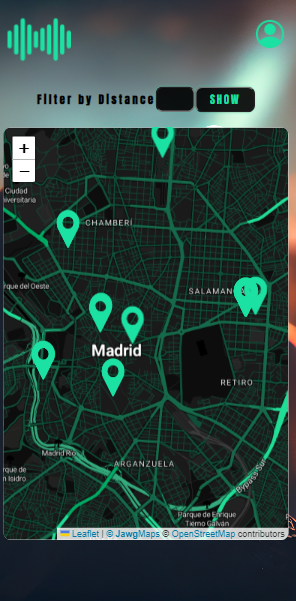

# Gigs4You
In this project, I wanted to build an application to quickly and easily view the concerts that will take place near me. 
I have put into practice my skills in layout, design, and Javascript. I have used Ticketmasters API to bring all the music info, dates, prices, venues... If you
want to create a project similar to mine, you have to register to get an API key.
## Summary
### Objectives
- Mobile first approach
- Show near by concerts
### Requirements
- DOM manipulation
- No external libaries, but for Maps
- Asynchrony: API request
- Branching system to manage de project
### Links
[Github pages](becabecks3.github.io/Gigs4You/)
### Screenshots

### Improvements
- Allow the user to register and save favourites
- Add more filters
